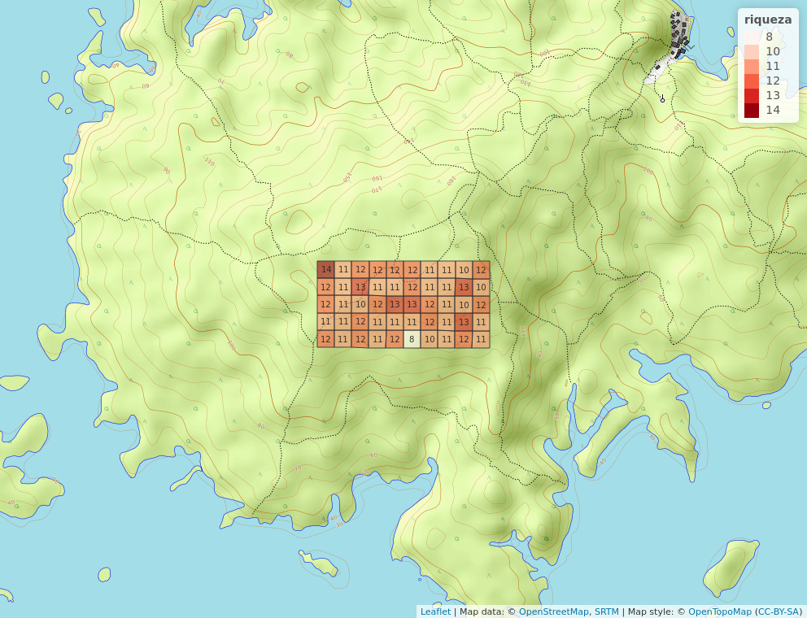

# Introducción 
Así como puede estar integrada una familia convencional, también las familias de plantas presentan unos criterios de agrupación que hacen de cada grupo botánico, verdaderas unidades identificables [@van2010biodiversidad]. Los senderos a seguir nos podrían encaminar por un sinfín de 
rutas alternativas, según, @van2010biodiversidad, la flora del estado de Sonora con un área de 184934 km2, actualmente tiene 3652 taxones específicos e intraespecíficos en 188 familias y 1103 géneros. 
La organización de las plantas en familias constituye una respuesta específica al orden en que la ecología, como ciencia que estudia las categorías agrupacionales que presentan los organismos en sus interacciones, ordena las unidades de grupos de plantas.
Viendo que la ecología es la forma sistemática de estudiar las diversas dimensiones que resultan de la interacción entre organismos diversos, nos apoyamos en la biogeografía, con la intención de conocer los emplazamientos que ocupan esos grupos de organismos, especialmente de plantas.
En este manuscrito se pretenden entender los aspectos fundamentales de la familia de plantas conocida como Moraceae, partiendo del estudio de gráficos, tablas y diagramas procedentes de invstigaciones realizadas en la Isla Barro Colorado, en Panamá.
Según, @clement2009morphological, la familia Moracea comprende 37 géneros y aproximadamente 1100 especies en regiones tropicales y templadas en todo el mundo. En América se aprecia una amplia dsitribución de las especies de esta familia, como lo es en el territorio de México, en las zonas de Sinaloa, o Chiapas, siendo de gran importancia para la comunidad de frugivoros que se alimentan de las mismas. 
Entre las especies reconocidas, se destacan: Brosimun alicastrum, Maclura tinctoria, Ficus mexicana, Ficus petiolaris, Ficus cotinifolia, Ficus spp. De esta misma distribución existen importantes trabajos, como son: @magallanesdistribucion, y @piedra2006genero. 
En ese orden pretendo identificar otras zonas del mundo donde podrían existir ejemplares de estas plantas correspondientes a los tipos de especies, y cuáles zonas presentan condiciones favorables para el predominio de las mismas, partiendo del análisis de los trabajos realizados en Isla Barro Colorado. 
En los últimos años pareciera que el papel de la geografía y de la ecología se confinara más a un grupo de investigadores que hace su trabajo más por vocación, que por farándula y fama, a sabiendas que muchos estudiosos se han dedicado más a estar en los medios que en centrarse en el trabajo para el cual se han formado que en este caso es la investigación, no el entretenimiento. Hacer ciencia es asumir un compromiso con la verdad, con la sociedad que espera respuestas serias para tomar grandes decisiones, pero el amarillismo nos ha oxidado un poco el compromiso con el deber. La ciencia después de la religión es como el único puerto en el cual se pued anclar el raciocinio, por ende debe ser depositaria dicha profesión de respeto y realización con cordura, pero sobretodo  de la mano del talento y el compromiso. A sambiendas de que la Isla Barro Colorado no es un espacio en donde se venga realizando ciencia de antaño, no existe allí, partiendo del territorio, una culutra cintífica milenaria que conserve los grandes hitos del quehacer intelectual, pero el pensamiento viaja de unas sociedades a otras y en cada latitud aquiere matices que le hacen ser. Sin embargo cada lugar para la ciencia resulta ser siempre nuevo y sobre todo si se trata de un lugar interoceánico como lo es la Isla Barro Colorado. Antes (siglos XVI, XVII, XVII Y XIX) el istmo de Panamá era solo visto como una ruta transoceánica, y de hecho hoy ostenta al legendario Canal homónimo como una arteria marítima que suple a la economía a escala global. Pero además de ruta comercial es el emplazamiento de BCI, escenario de este trabajo científico.
Y que bueno que se ha roto el paradigma de ser el antiguo Egipto, la tierra fértil de la investigación, aunque evidentemente son campos de estudio distintos, pero Latinoamérica en su quehacer histórico se ha dejado colocar un estereotipo de aversión a la investigación. Como que somos buenos para la transculturación y todo aquello que sea plástico, pero no para incursionar en algo tan serio como lo es el hacer ciencia. Pero seguimos creciendo, y es cierto que nos independizamos, y adquirimos indentidad júridica, pero las costumbres y las mantalidades aún nos abruman.
Necesitamos independizar el talento, y darle soberanía al genio, así manejaremos un terremoto o cualquier otro evento natural sin que antes lo depuren los del norte.

# Metodología
Apoyándome en los trabajos realizados en la Isla de Barro Colorado, mediante un anális inductivo, pretendo dilucidar los datos estadísticos más pertinentes sobre la familia de plantas conocidas como Moraceae. Dejando claro que en otras zonas del continente existen importantes trabajos sobre esta familia de plantas, susceptibles de estudios debido en gran parte al soporte que constituyen en la alimentación de una amplia comunidad de frugívoros. Tomando como escenario esa pequeña isla del istmo de Panamá, empleando un serie de recursos que han derivado de profundas investigaciones, intento crear una nueva fisonomía a esta familia de plantas, o por lo menos generar algo nuevo para quienes consumen este tipo de artículos.
La isla de Barro Colorado se formó tras la creación del lago Gatún en 1913, durante la construcción del Canal de Panamá (1904-1914), la isla de 15 kilómetros cuadrados, alberga una de las estaciones más antiguas de investigación tropical del mundo donde se han llevado a cabo estudios por más de 100 años.  
La Isla Barro Colorado o BCI, por sus siglas en inglés, es uno de los puntos geográficos más estudiados en el mundo, es como una especie de Meca para los investigadores que quieren desarrollar allí sus estudios, muchas veces acompañados de sus estudiantes, estudiantes que en lo adelante también realizarán sus propias investigaciones por separado. En dicha isla todo está registrado, cada comunidad de insectos, plantas y otros animales, están debidamente mapeados, con inscripciones por doquier. Tal vez por la Amplia diversidad de orgaismos que allí predominana, se hace esta clase de inferencia en esta isla que se ha convertido en un laboratorio global, y ese es el caso que me compete, seguir ese pequeño trillo prar llegar a grandes verdades que requieren de una cantidad de recursos unaudita y tiempo, por el momento no disponibles si nos embarcaramos en hacer un itinerario parecido al de Darwin o el de Humboldt. 
Algunos estudios como los de @fredericksenbibosi, resaltan la importancia de las moraceae en el sentido de que sirven de alimentos a una amlpia comunidad de frugivoros, pero los cierto es que también, tienen gran importancia en el sector maderero. Como se dijo en un principio, todo el material de apoyo, proviene de las investigaciones de la Isla de Barro Colorado, el cual consiste en el empleo de tablas, cuadros, mapas, y otros diagramas que proceden de sendas investigaciones. Para el estudio de las variables ambientales se han empleado los cuadros de 1 Ha de BCI. Variables ambientales numéricas escaladas de 0 a 1, para el estudio de las pendientes, se emplea el mapa de curbas de nivel de la isla. También se ha empleado el mapa que refleja el PH de este espacio insular. También se establecen correlaciones a partir de estos recursos científicos que son el fruto de largos proceos de estudio. 

Este es el escenario de nuestro estudio, ver figura \ref{fig:bci_map #1}.

{width=100%}

Por igual se emplean los cuadros de variables ambientales nominales de 1  Ha de BCI, constituida por categoría de edad, habitat, geología y quebrada. Otro recurso de vital importancia son las variables ambientales numéricas escaladas de 0 a 1 de una Ha de BCI. La interacción con estas fuentes de información ayudan a tener una aproximación más concreta sobre la diversidad con relación a la familia que nos compete. Es cierto que el condicionamiento de diversas especies de plantas en distintos espacios termina creando casos de escasa homogeneidad, que de una u otra forma se rompa el patrón de similitud. Es por ello que en este trabajo se maneja más un enfoque particular de la realidad existente en BCI. Algunos estudios demuestran que las moraceae no solo sireven de alimento a los frugivoros, o como soporte en la industria maderera, también sirven de huesped a algunas especies como es el caso de las avispas, las cuales se desarrollan en las flores femeninas de dichas plantas según @cardona2007avispas. Otros estudios abordan las propiedades químicas de dichas plantas, este trabajo buca definir las características más notables de esta familia de plantas apoyándonos en el escenario de BCI. Es notorio el mapa de variables ambientales nominales. Los demás recursos se verán en la medidad que se deasarrolla el trabajo, siguiendo el orden que en un principio nos hemos propuesto.

Todo lo anterior obedece a la parte de datos explotorios, también está presente el segmento correpondiente a la medición de asociación, en el que se presentan los modos Q y R, el primero referido a la medición de asociación de sitios, en este caso por medio de la distancia, y la similaridad de Jaccard. El modo R se refiere a la medición de la asociación entre pares descriptores como son variables o especies, también hago uso de la matríz de Hellinger. En el método de análisis jerárquico, se emplean los diagramas del árbol o dendrogramas (método de cuerda y de Ward)

# Resultados

Análisis Exploratorio de Datos

A continuación se muestran las mediciones de PH, mapa de pendientes, mapas de abundancia, tanto global como de la familia, mapa de riqueza global y de la familia, variables ambientales numéricas, y nominales en una parcela de 50 hectáreas, integrada por subdivisiones de una hectárea, todo ello correspondiente a la familia de las Moraceae.
En el caso del PH tenemos que es ácido, sgún los mapas y diagramas consultados, estas condiciones para las Moraceae, y cualquier otra especie en condiciones extremas, sería perjudicial. 
El PH del suelo es importante porque los vegetales solo pueden absorver a los minerales disueltos y la variación del PH modifica el grado de solubilidad de los minerales y nutrientes.
En el siguiente mapa, se pueden apreciar las medidas de PH presentes en la Isla Barro Colorado en una parcela de 50 hectáreas:

{width=100%}

Como se puede ver, el PH es eminentemente ácido, en una pacerla de 50 Ha, la familia de plantas que nos interesa sobreabunda en estas condiciones. Muy probablemente las familias de moraceae presentes en otros lugares prosperen bajo condiciones muy diferentes, de como se muestra en este mapa. Sin embargo los lugares a una misma latitud en el planeta, se caracterizan por operar sobre los indiviuos bajo las mismas condiciones, por ende las condiciones de PH en otras regiones tal vez no se alejen tanto de las que por el momento se citan en el mapa. El PH es un factor que en lo adelante incidirá en la utilidad de la planta, especialmete a nivel comercial, la presencia de uno o varios elementos, o la ausencia de estos determinará el valor utilitario de estas. La quimiotaxonomía o qimiosistemática evalúa la presencia de elementos químicos en especies vegetales, el aspecto químico de la clasificación de las plantas, se basa en sus constituyentes es decir en sus características moleculares. estas al igual que las características geomorfológicas son controladas químicamente. Dentro los factores físico químicos las medidas de PH no suelen presetar cambios significativos, en las inmediaciones de las aguas del Canal de Panamá, pese a que se presentan ligeras fluctuaciones en las medidas de este indicador, que en esencia muestran la sensibilidad de las aguas circundantes, este por lo general es regular [@simmonds2002parametros,]. Esto sugiere un grado de apatabilidad bastante desarrollado por las especies de la familia en cuestión, no solo al medio de la isla, sino tambien de las áreas circundantes. La fenología reprodctiva de la Isla de Barro Colorado ha sido descrita extensamente por algunos autores. Los árboles más grandes presentan un pico de floración entre febrero y junio, y alcanzan un máximo en marzo y abril, justamente al final de la estación seca [@williams2002patrones,]. Tal vez este régimen de floración y de adaptación permitan a las Moraceae mantener una fenología por encima de los patrones físico químicos, en este caso especialmente el PH.

En el mapa de abundacia global se advierten valores no lejanos de lo ideal cuando se emplean parámetros de la muestra comprendidos entre 3600 y 5000, que en este caso sería una escala, en una parcela de 50 Ha. El Valor promedio que representaría cada Ha en una media hipotética sería de aproximadamente casi 4000 individuos de esta familia, sin embargo tiende a cambiar cuando hablamos de riqueza. Si bien existen dentro de esta familia, especies representativas de casi todas las formas de vida leñosas, las formas más comunes entre las especies de bibosi, son por un lado plantas hemiepífitas estranguladoras o matapalos y por otro, plantas no epífitas con sistema propio de sustento o higuerones [@fredericksenbibosi,].

{width=100%}

En el mapa de abundancia de mi familia no se presenta tampoco que la muestra por hectárea se aleja de forma marcada del parámetro empleado para la parcela de 50 Ha, en este caso en un parámetro de entre 200 y 700 individuos, podría verificarse una especie de relación directa entre el primer y segundo mapa.
En ambos casos cada Ha, adquiere valores próximos a la dimensión numérica de individuos presentes en la parcela:

{width=100%}

Como puede corroborarse existen muchos individuos, en este caso citando la abundancia, de una determinada especie de la familia de Moraceae en una Ha de la Isla Barro Colorado lo que muestra una amplia densidad para una parcela de 50 Ha. Siendo estas plantas muchas veces ejemplares de gran dimensión en muchos de los casos, se infiere que estas forman un dosel impenetrable, típico de muchos bosques de la selva tropicla centroamericana, en donde BCI no es la excepción. No solo estaríamos hablando de Moraceae, sino de otras especies que forman la cubierta de esta región intertropical.

Panamá es uno de los paises más diversos, ya que tiene el 10% de la fauna y flora global. México tiene el 11%, pero Panamá cabe en México unas 26 veces. Panamá tiene 1010 especies registradas, de esa cantidad un tercio le corresponde a Barro Colorado. El bosque de Barro Colorado se cierra muy abajo y es difícil ver algunas especies de aves, solo se pueden escuchar.
Las especies de Moraceae por lo general corresponden a árboles de hojas anchas (latifoliados), lo que hace de los suelos de estas especies, lugares prácticamente impenetrables por la radiación solar, algo típico de la selva en cualquiera de sus denominaciones. En el bosque la temperatura promedio es de 27 grados centígrados (80$^\circ$ fahrenheit), y la humedad es bastante alta. Otro factor que incidirá sobre este tipo de angiospermas, es el de la pendiente del terreno. La isla de Barro Colorado constituye uno de los ecosistemas más grandes del mundo, lo que deja al descubierto la gran adaptabilidad que presentan algunas plantas a este medio. Por tratarse de un lugar sumamente pequeño, los rasgos orográficos han de ser casi imperceptibles, pero sobre todo la edad de la isla no la hace poseedora de formas del relieve que estén consolidadas dentro de lo ques es la periodización geológica. Pues la isla se formó hace algo más de un siglo, tiempo en el qe no caben eventos geológicos trascendentales. En el mapa de pendientes citado anteriormente se pueden visualizar estos menudos contrastes.En las curvas de nivel se pueden apreciar los valores pequeños de altitud, lo que de un modo u otro favorece a estas familas.
La isla de Barro Colorado es realmente joven dentro de lo que es la escala de tiempo geológica, solo tiene algo más de 100 años de existencia lo que nos advierte de un relieve poco accidentado, debido en gran parte a su tamaño, pero sobre todo a su edad.
En este sentido sería bueno apreciar las pendientes, y ver el valor de la altitud en esta especie de enclave marítimo, lo que también favorece la existencia abundante de ejemplares de Moraceae.

Ver mapa de pendiente\ref{fig:pendiente BCI}

{width=100%}

Para una consideración genral de la parcela de 50 Ha se destaca gran pendiente, lo que es favorable para formaciones boscosas como la que nos compete, aunque inservibles para la agricultura bajo cualquier consideración que se haga a favor de la vegetación que no sea referente a la anteriormente citada. Sin embargo la altitud guarda una relación acorde con las dimensiones de la isla. Las plantas como las Moraceae mantienen una relación favorble con estos grados de inclinación del terreno. Ya en espacios controlados y con plantaciones con las qe se persigue un determinado propósito se tiene un conocimiento sobre el manejo de la pendiente, a sabiendas de que en este escenario han crecido de forma silvestre sin intervención alguna de la mano del hombre.
BCI constituye como una especie de interrupción del sistema orgráfico de zona istmica panameña y centroamericana, pues la espina dorsal de toda la costa del Pacífico, aunque no se eleva de forma tan imponente como en los Andes o en las Montañas Rocosas, en Centro America poseen continuidad, aunque con una escasa altiud. Es como si se tratara de un lugar construido para la investigación, en medio de sistemas tan extremos, es decir franja estrecha de tierra y masas imensas de agua que aguardan a ambos lados del Canal de Panmá (situación ístmica). En la Isla de Barro Colorado la altura sobre el nivel del mar es pequeña, eso reflejan las curvas de nivel presentes en los mapas anteriores.

En el caso de las variables ambientales numéricas se obtiene los siguientes valores:

{width=100%}

Aquí podemos ver una especie de síntesis de las informaciones que ofrecen las variables ambientales de una Ha, escaladas de 0 a 1. 
En el caso de las geoformas, correspondientes a llanuras, se obtienen valores grandes en un segmento de la escala que va de 0.00 a 0.25, lo que refleja un terreno eminentemente llano.

Con relación a las vrtientes ocurre todo lo contrario, se obtienen valores grandes, en el segmento de la escala que va de 0.75 a 1.00, lo que se refiere a mayor inclinación en contraste con las tierras llanas.

Otra geoforma como es el caso de los valles, presenta valores muy pronunciados en los segmentos bajos de la escala citada, por ende se puede inferir que las tierras bajas son predominantes por encima de las tierras altas.
Los valores de la escala muestran amplias diferencias entre unas variables y otras, pero dentro de la misma escala, suele verse la superioridad de una sobre otra.

Al estar dispuestas en el primer cuadrante de un plano bidimensional, algunas variables por Ha, presentan mayores valores en X que en Y, y viceversa. Sería esa una forma inteligente de ver el comportamiento de las variables con realación a los ejes X e Y. Lo mismo que en los mapas de riqueza, tanto de la familia como global, puede verse la superioridad, de un bosque que corresponde a la formación vegetal tipo selva, propio de regiones tropicales, intertropiclaes, y ecuatoriales, desde luego con algunas variaciones por cuestiones de latitud.

A continuación el mapa de variables ambientales nominales

{width=100%}

Aquí se distingue variables como la categoría de edad, geología de la zona, hábitat, y la quebrada. El hábitat de bosque viejo en terreno alto (OldHigh), se destaca por su relativa minoría. En tanto que el bosque viejo en relieve bajo (OldLow) es el más abundante. El bosque viejo con pendiente (OldSlope), es relativamente abundante. El pantano es escaso (Swamp), así también el bosque joven (Young). En cuanto a la geología tenemos que el tipo de roca predominante es de tipo intrusivo o plutónica. Las quebradas o barrancos son estrechos. Existen dos grandes categorías dentro de la variable de edad, el bosque viejo en terreno bajo, y el bosque viejo en terreno alto. De lo anterior se infiere que existe más terreno bajo con bosque viejo en BCI en una base gelógica joven, que con las demás variables.
El mapa de riqueza presenta un formato similar a los de abundancia, con comportamientos diferenciados por Ha, comparados con la parcela de 50 Ha.
En el siguiente mapa puede apreciarse la riqueza de la famiia botánica bajo estudio (Moraceae) por Ha:

{width=100%}

En esta parte puede apreciarse que la riqueza es casi la misma por Ha, acercándose al nivel superior de la escala, así se puede asumir que el grado de dispersión de algunos individuos de la familia Moraceae es casi nulo. Existe una gran riqueza de estas plantas que ayudan en gran parte a mantener este gran ecosistema.
Sin lugar a dudas puede apreciarse la inmensa riqueza que hay en BCI por hectárea, solo concerniente a Moraceae, formando un tapiz casi perfecto, de individuos distintos de una misma familia.
Ya para el mapa de riqueza global se advierten mayores contrastes por hectárea, pero igual se impone la diversidad, la multiplicidad de individuos es asombrosa.

{width=100%}

Como se pudo ver en los mapas, y los cuadros de variables, la Isla de Barro Colorado presenta gran riqueza y abundancia en espacios muy reducidos, especialmente de la familia de las Moraceae. Todo esto nos hace pensar que se trata un gran bioma en miniatura en el que se reducen las distancias, y se incrementan los ejemplares que hacen confluir la biología y la geografía. Tal vez en el aspecto geomorfológico no se puedan hacer conjeturas similares. Pero desde la biogeografía, el sendero es complejo. El hecho de que exista este conglomerado de especies de plantas y animales, requiere de unas condiciones óptimas para hacer posible la vida de este gigantesco ecosistema. En los mapas de abundacia, tanto global como de la familia se advierte un crecimiento casi perfecto, bajo condiciones físicas y químicas que le son favorables a la vida en esta parte del mundo.

No se ignora que a la misma latiud se encuetren condiciones similares en otros rincones de la tierra, de hecho las zonas intertropicales, las tropicales y las ecuatoriales se caracterizan más por la riqueza que por la abundancia. Pero en ese sentido tenemos millones de kilómetros bajo estudio si nos adentraramos en las grandes selvas que se conocen de antiguo, y tal vez nos toparíamos más con abundancia que con riqueza. Las grandes expediciones de la historia se han distinguido siempre por cubrir amplios itinerarios, que a su vez implican grandes distancias. En ese sentido nunca dejaríamos de mencionar a Darwuin, Humboldt, y otros investigadores que no fueron merecedores de las ventajas de esta aldea global que ha venido a simplificarlo todo, aunque no todos estamos inmersos en ese pequeño nicho cibernético.
En los cuadros de variables ambientales, se corroboran las diferencias entre unas y otras, se distinguen tierras bajas de otras no muy altas. Pero no solo se analizan los rasgos geomorfológicos, otras variables ofrecen tambien allí su concurso. Aprecen valores de PH, riqueza global por igual, abundancia global, entre otras variables. 

Medición de Asociación (Modos Q y R)

En esta parte se aborda lo que es la medición de asociación, tomando en cuenta lo que son los valores de disimilaridad o distancia, así como las matríces de correlación.
Dentro de los modelos de medición de asociación existen los modos Q y R, en este caso de la distancia o disimilaridad, tenemos el modo Q que describe la distancia entre objetos cuantitativos. La paradoja de Orlóci plantea que la distancia euclidea es más pequeña entre sitios que no comparten especies que entre sitios que sí las comparten.
A continuación se presenta una matríz de disimilaridad.

{width=100%}

La matrz de disimilaridad es es una representación de la medición de asociación entre objetos en el modo Q, como serían los sitios de muestreo. En esta matriz se puede apreciar una fuerte asociación entre objetos y esto lo indica la continuidad del color rosado (cuadro de la derecha). En este caso nos referimos a la matriz de la derecha, que es la matriz ordenada,  a partir de la primera. Por ejemplo entre los sitios 40 y 35 existe una distancia muy pequeña entre sitios parecidos para la matriz ordenada.
La transformación Hellinger permite hacer la interpretación en base a dos colores representativos: Color fucsia (magneta, rosa) que equivale a corta distancia, muy similar, y el cian o celeste que significa gran distancia o poco similar, todo esto con relación a los elementos de la familia de las moraceae. 
Algunos de los valores de disimilaridad o de distancia entre objetos que podemos apreciar dentro de la transformación Hellinger son los siguientes: Entre los sitios 2 y 1, tenemos que la distancia (dbl) es de 0.187, entre 3 y 1 es de 0.439, entre 4 y 1 es de 0.499, entre 5 y 1 es de 0.430, entre 6 y 1 de 0.297, entre 7 y 1 es de 0.280, entre 8 y 1 es de 0.492, entre 9 y 1 es de 0.584, entre 10 y 1 es de 0.425, y entre 11 y 1 es de 0.269 lo que revela una escasa distancia o disimilaridad entre los objetos.

A continuación presento una versión mejorada de la matríz ordenada de datos cuantitativos de especies (abundancia) con fuerte asociación en la diagonal.

{width=100%}

En esta matriz de disimilaridad o de distancia vienen a recrearse los anteriores casos de abundancia de los mapas de la Isla de Barro Colorado. En la diagonal se pueden apreciar los sitios que poseen características similares con la menor distancia(color rosado), mientras que en los demás lugares se aprecian lugares con características similares a mayor distancia y con una menor asociación (color cian o celeste).
Hasta el momento me he centrado en el modo Q que mide el nivel de asociación por medio de la disimilaridad o similiridad.
Algo sumamente importante dentro del modo Q, en este caso basándome en datos binarios (presencia/ausencia) es la famosa distancia de Jaccard, la misma se puede expresar como la proporción de especies no compartidas. Para el caso correspondinte de los datos de moraceae, la distancia (dbl) muestra los siguientes resultados para algunos sitios: Entre 2 y 1, la distancia es de 0.22, para 3 y 1 es de 0.33, entre 4 y 1 es de 0.222, para 5 y 1 es de 0.3, para 6 y 1 es de 0.333, para 7 y 1 es de 0.222, para 8 y 1 es de 0.333, para 9 y 1 es de 0.333, para 10 y 1 es de 0.4, y para 11 y 1 es de 0.333, evidenciando en este caso una fuerte asociación.

La similaridad es la proporción de objetos compartiods entre sitios, en la siguiente gráfica de la matriz pueden apreciarse las espcecies compartidas entre sitios.

{width=100%}

Puede apreciarse en los bloques de colores las especies compartidas entre sitios, y que son exclusivas de dichos sitios. Por ejemplo para las variables a, b y c, que se desprenden de la fómula, incluida en los scripts reproducibles que sirven de soporte a este trabajo, de la similaridad, donde a representa el número de especies compartidas, b es el número de especies exclusivas del sitio 2 y c el numero de especies exclusivas del sitio 1. La cantidad de especies compartidas entre sitios con relación a las moraceae es grande, esto debido a la ausencia de ceros, hecho que en la paradoja de Orlóci refleja cercanía según la distancia euclídea que hace ver próximos los lugares o sitios que no comparten especies o individuos.  

En el modo R se mide la asociación entre pares descriptores, es decir variables o especies, mediante la covarianza y la correlación. Por ejemplo para las variables a b y c, que se desprenden de la fómula de la similaridad, donde a representa el número de especies compartidas, b es el número de especies exclusivas del sitio 2 y c el numero de especies exclusivas del sitio 1.

Un ejemplo ilustrativo sería el mapa de calor

{width=100%}

En el mapa de calor mostrado se muestra una relación de dependencia en la diagonal de la derecha, esto es lo que se mide en el modo R, la asociación entre elementos descriptores, en este caso la abundancia de especies como variables. Entre la cainito aspidosperma y la trichinia tuberculata se nota una fuerte dependencia, evidenciado por la continuidad del color fucsia o rosa. Lo mismo no ocurre con los colores de los bordes que reflejan franjas más pequeñas, y a su vez degradas, lo que evidencia ausencia de dependencia.
Esto así cuando se trata del modo R aplicado a datos cuantitativos de especies, que reflejan la abundancia.

Análisis Jerárquico

El análisis de agrupamiento, consiste en una agrupación sucesiva basada en la repetición de un procedimiento dado de grupos de objetos, hasta que estos encuentren su lugar, se basa en la construcción de dendrogramas. El análsis jerárquico se caracteriza por tener un enfoque aglomerativo, lo que implica un algoritmo ascendente, y la ordenación de los subgrupos de objetos en un único grupo. Los algoritmos del análsis jerárquico son los criterios de enlace, y estos a su vez se integran por los siguiesntes tipos: Enlace simple, enlace completo y enlace promedio. Los metodos de representación utilizados son: Agrupamiento aglomerativo por enlace simple, agrupamiento aglomerativo por enlace completo, y agrupamiento aglomerativo por enlace promedio.

Agrupamiento aglomerativo por enlace simple:

{width=100%}

Cuando se construye este dendrograma, empleando la menor distancia entre sitios, se obtiene una matriz de cuerdas o matriz normalizada. En este dendrograma se pueden apreciar grupos de objetos muy agrupados en otros mayores con una altura pequeña, los que poseen la mayor altura en ramas, poseen la menor cantidad de objetos (hojas), es decir se presenta una mayor abundancia en los dendrogramas que se encuentran formando subgrupos. Este dendrograma recuerda la forma de una escalera.

Agrupamiento Aglomerativo por enlace completo:

{width=100%}

En esta imagen, aunque se ilustran los tipos considerados de dendrogramas, nos interesa el completo.
En el agrupamiento aglomerativo por enlace completo, el criterio empleado es la mayor distancia o menor similaridad, el vecino más lejano. En este dendrograma se muestra una escalera pero con menor sucesión, se distinguen grupos de dendrogramas como en el caso anterior, solo que en esta ocasión los grupos con mayor distancia son poco numerosos en contraste con los los grupos que presentan la menor distancia, y la altura dominante para los cuadros mayores es de 0.8 en su generalidad.

Agrupamiento aglomerativo por enlace promedio:

{width=100%}

El método de Ward, aunque no es un método por enlace, lo elijo por su fácil comprensión (en este caso sería el UPGMA, para el caso de la media o promedio), recuerda la silueta de una pirámide toscamente dibujada, con una interpretación visual más factible que en los casos anteriores. Existe una regularidad en los subgrupos, lo que refleja, al igual que en las secciones anteriores una fuerte asociación, mayor similaridad que disimilaridad en las partes dominantes o más visibles. Otro ejemplo de visualización lo ofrece el modelo de agrupación aglomerativa por enlace promedio, UPGMA, en el cual aparecen siluetas aglomerativas y repetitivas que reflejan una continuidad en la similaridad en los subgrupos.

Interpretación de Agrupamiento Jerárquico:

En esta parte estamos a la altura de elegir métodos que nos permitan minimizar la mayor cantidad posible de unidades de grupos en los dendrogramas. Se establece la correlación cofenética y para la misma los métodos convenientes son los de Ward y el UPGMA.
En esencia consiste en obtener la menor cantidad posible de siluetas que se distinguen por la existencia de pequeños grupos de figuras.
En la siguiente imagen pueden apreciarse los cortes de las siluetas en tamaños menos complicados de analizar y no muy distantes en su dimensión.

{width=100%}

El método Ward es uno de los más ideales para elegir un dendrograma único que permita apreciar por simple inspección el tamaño de las siluetas, y el número de sitios que contienen, en este caso serían tres cuadros de 12 y 13 sitios para el primer y segundo cuadro respectivamente, y de 25 sitios para el tercero, todos a una altura de 1.3 aproximadamente dentro del dendrograma. En este dendrograma pueden apreciarse las siluestas más fácilmente que en los ejemplos anteriores.

Una forma de ilustrar mejor la disimilaridad y la similaridad entre los agrupamientos o dendrogramas es por medio del mapa de calor de la matriz de comunidad fusionado con el dendrogrma. El color rosa más intenso corresponde a los sitios más próximos, mientras que la degradación de este corresponde a lugares menos próximos, en el color celeste intenso también se cumple lo mismo, solo que el color rosa es dominante.

{width=100%}

# Discusión
La abundancia y riqueza de la familia Moraceae, dentro de la isla Barro Colorado, es vieja y asentada en terreno bajo, en su generalidad, con una adaptación bastante ajustada a las condiciones de los factores físico químicos de dicha isla, por lo general son plantas perennes, de gran porte que sirven de alimentación a los individuos frugívoros que allí habitan, constituyendo con su dosel el típico paisaje de la selva tropical crentroamericana. 

Dentro de la selva del ístmo, BCI, es como un esctracto sintético susceptible de múltiples investigaciones, por su amplia concentración de flora y fauna.
Si bien la Isla Barro Colorado es un enclave marítimo, y de investigación científica, contando por ende con las riquezas antes descritas, es motivo de cuestionamiento, el cómo un espacio, esta pequeña isla, haya acumulado estas riquezas en tan poco tiempo, a sabiendas de la zona geoastronómica en que se encuentra. Sería más aceptable la abundancia.

Pero la construcción de riquezas ecológicas, ademas del emplazamiento geográfico, requieren de eventos geológicos, geográficos y tal vez antrópicos, en este caso tenemos el Canal de Panamá, el recuerdo mejor conservado de la injerencia yanqui en el Caribe. Una isla que se formó en algo más de un siglo, pues de la misma forma corre el riesgo de desaparecer. Pero esto solo compete a un asunto geológico, que no concierne a este trabajo, solo de manera parcial.

Nuestro interés se centra, en esta parte, en las condiciones que han creado este espacio insular tan singular, en un tiempo tan breve, en el istmo de Panamá. Si bien sabemos que América es la masa continental que alcanza mayor extensión latitudinal, es probable que en todo el tiempo precedente a la construcción del canal, se dieran las migraciones de especies tanto del norte como del sur. Aunque, una vía interoceánica artificial como lo es el Canal de panamá, probablemente no provocaría cambios notables en el equilibrio biológico de las comunidades de individuos que poblaban esta parte del continente. 

La sostenibilidad de las especies de plantas y animales que allí existen no se puede poner en duda, por las condiciones climáticas que en dicho lugar se mantienen. Es como si tratara de un ambiente controlado y planificado. De modo que las investigaciones siempre tienen una página que arañar, dando motivos de colgarse una mochila y salir a hacer trabajo de campo. 
Es muy probable que para muchos, BCI siga siendo el secreto mejor guardado dentro de las zonas de investigación más llamativas del mundo,lo cual resulta ser asombroso por el peso que posee el istmo de de Panamá a escala comercial.

El presente artículo ha sido un intento por abordar la información básica de la familia de las Moraceae, desde una perspectiva científica, teniendo como escenario la Isla de Barro Colorado. En el desarrollo me he volcado más en lo que es la distribución de individuos por ha, en una parcela de 50 ha, tanto desde una perspectiva global, como específica, en las condiciones del terreno, así como en la situación geográfica, pretendiendo dar un enfoque lo más abarcador posible, siguiendo estas variables, que han de ser de las más pertinentes para la consideración de un trabajo de campo.

Sabemos que esta familia de angiospermas posee gran riqueza y abundancia en esta parte del istmo, y que las condiciones típicas del suelo son idóneas para su sostenimiento. En un principio mencioné el caso de Mexico, por sus estadísticas en cuanto a predominio de plantas, especialmete de la familia que estoy tratando, un basto territorio que alberga todo lo que le permite su inmensa superficie. Sin embargo, BCI, es otro Mexico tipo laboratoio destinado a la investigación.

Pero como dirían por ahí, la ciencia está en crisis y cada vez es más pequño el número de hombres y mujeres que se interesan por escribir en favor de la ciencia, de modo que para muchos estos lugares pasan desapercibidos, y la existencia de plantas y animales como un trazo más en un mural en el que no sale el sol, en el que no existe el dinamismo. Pero no dejemos esto en manos de la pobalción, cedamos un poco a los sistemas de gobierno que son los que generan los programas de educación, y en ellos dejan cada vez menos espacio a la ciencia, una especie de neocolonialismo. 

Existen muchos lugares en el Mar Caribe que como BCI, pueden ser grandes laboratorios, a partir de los cuales se pueda hacer ciencia, producir material científico de utilidad, pero la dependencia es peor que el analfabetismo. Por ello tal val tenemos una ciencia estacionaria, incapáz de dar el santo de la libertad.
En nuestro territorio, la República Dominicana, han existido personajes que se han destacado en la ciencia, pero siempre serán dominicnaos.

Y se espera que el caudal de inforamción que se generan en las investigaciones alcance a estos lugares, porque la ciencia genera identidad a los lugares y los hace crecer.
BCI, tiene algo más de 100 años, pero Panamá como nación es más vieja, y no es mi incumbencia el tema político, ni de este artículo. Pero hago la aclaración porque entiendo que se puede crecer en la ciencia, siempre dejando claro que cada pueblo tiene contextos distintos y que el error siempre será tratar de copiar. Este ha sido un trabajo en virtud del interés biológico, y geográfico. Esperando que sea del agrado de quienes puedan leerlo.

# Agradecimientos
Quiero dedicar todo mi agradecimiento, primero a Dios porque es quien hace posible todas las cosas, luego al maestro José Ramón Martínez Batlle, maestro de la escuela de ciencias geográficas en la  facultad ciencias de la Universidad Autónoma de Santo Domingo, en las áreas de biogeografía, geomorfología, y anteriormente de geología por enrutarnos en este mar de investigación que siempre termina arrojando cosas nuevas. Por último a mis compañeros de carrera, Carolain Pérez Ureña, Ana Hilda Valera, Darihanna Linares y Wilson Robles Rosario, sin ellos esto no habría sido posible, muchas gracias.

# Información de soporte

{width=100%}

{width=100%}

{width=100%}
{width=100%}
{width=100%}

{width=100%}
{width=100%}
{width=100%}

# *Script* reproducible

\ldots

# Referencias
